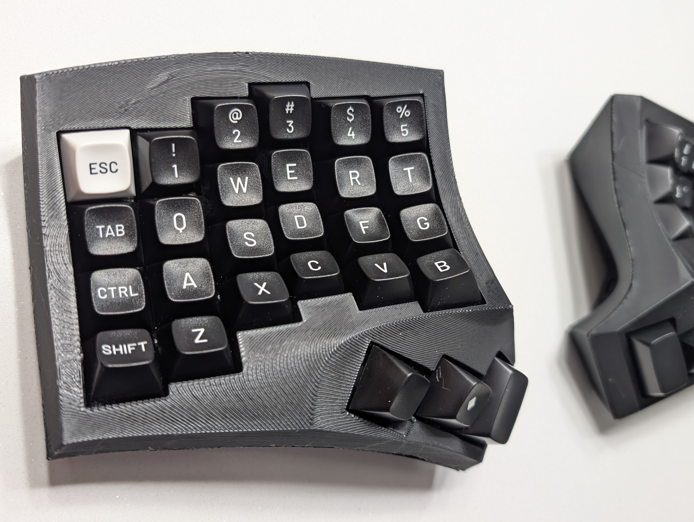

# Cygnus 4x6x3 keyboard



This [ZMK](https://zmk.dev/) configuration was copied from [juhakaup/zmk-cygnus-4x6](https://github.com/juhakaup/zmk-cygnus-4x6).

# Harware Operation
* Batteries: 3.7v 110MAH LIPO
Batteries need charging every ~3 weeks depending on usage.

* Power switches
```bash
UP == ON, DOWN == OFF
```
* Reset buttons
- Reset: 1 press
- Bootloader: 2 rapid presses
- Pairing: Press and release both halves simultaneously while not connected via USB.


## Default Keymap

### To change the keymap manually
1. Editing the `config/cygnus.keymap` file
2. Pushing changes to a topic branch (or main)
3. Open a pull request with the changes
4. Download the artifact generated by the Github workflow.
5. Place each half in bootloader mode by double pressing reset buttons
6. Copy the `uf2` file for inteded half (left or right) to the RP-2 USB drive that appeared for the microcontroller.

### To change the keymap with the online editor
1. Go to [this keymap editor](https://nickcoutsos.github.io/keymap-editor/) and authorize access to this repository. 
2. Select this repository and edit the keymap using the UI
3. Save the changes to the repository
4. Follow steps 4-6 above of downloading the workflow artifact, and flashing to each half of the keyboard.

### L0: Base


### L1: Function


### L2: Symbols


### L3: System


* [List of Keycodes](https://zmk.dev/docs/keymaps/list-of-keycodes)
* [Keymap Editor](https://nickcoutsos.github.io/keymap-editor/)
