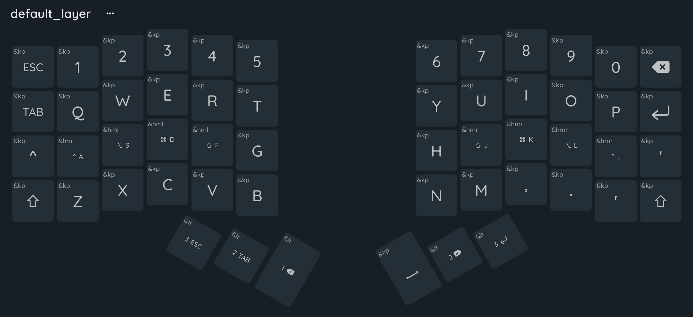
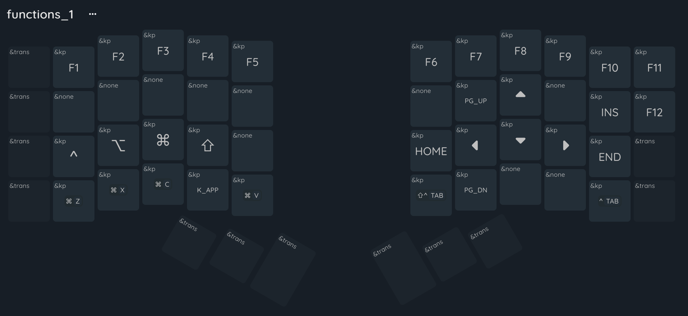
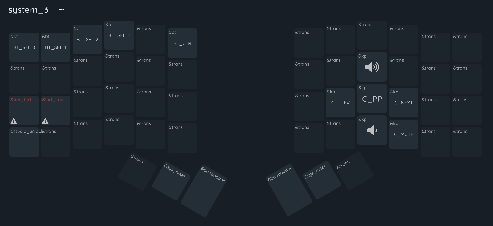

# Cygnus 4x6x3 keyboard

This [ZMK](https://zmk.dev/) configuration was copied from [juhakaup/zmk-cygnus-4x6](https://github.com/juhakaup/zmk-cygnus-4x6).

## Default Keymap

### L0: Base

### L1: Function

### L2: Symbols

### L3: System

* [List of Keycodes](https://zmk.dev/docs/keymaps/list-of-keycodes)
* [Keymap Editor](https://nickcoutsos.github.io/keymap-editor/)
